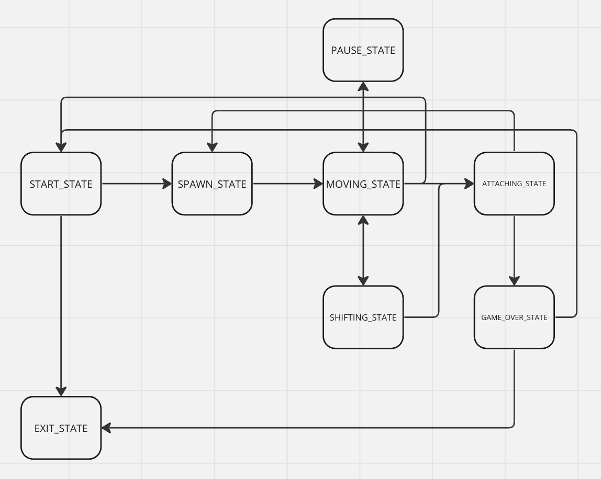

# C_Tetris

Implementation of Tetris game using C programming language and structured approach

To run Tetris in console:

```
cd src/
make
./build/tetris
```


## Important notes

- The program consists of two parts: library implementing a tetris game logic, and console interface developed with "ncurses" library
- Game field size is 10x20 like in BrickGame Console
- The tetis game logic is developed using finite state machine (FSM)
- The program build is configured using a Makefile with a standard set of goals for GNU programs: all, install, uninstall, clean, dvi, dist, test, gcov_report
- The library has been developed in C language of C11 standard using gcc compiler;
- Full coverage of library functions code prepared with unit-tests using the Check library;
- The gcov_report target generates a gcov report in the form of an html page;
- Library code follows the Google style

## Description

The game goal is to score points for building lines from blocks generated by the game. The generated block descends down the playing field until it reaches the lower border or collides with another block. The user can rotate the blocks and move them horizontally, thying to fill rows. After filling the row, it is destroyed, the player scores points, and the blocks above the destroyed row go down. The game ends when one of the falling figures stops at the highest row

There are 7 types of figures in the game. The possible positions of the figures are shown in the picture below

![TetrisFigures] (img/SRS-pieces.png)

## Available actions:

⬅️ – move the figure to the left
➡️ – move the figure to the right
⬇️ – drop the figure to the bottom
SPACE – rotate the figure clockwise
P – pause (continue the game)
ESC – exit

## Features

### Points scoring

1 line destroyed – 100 pts
2 lines destroyed – 300 pts
3 lines destroyed – 700 pts
4 lines destroyed – 1500 pts

### Levels

Every 600 pts increases the level by 1. The maximum level is 1


### Record storing


## FSM for Tetris



- START_STATE – initial game state (main menu)
- SPAWN_STATE – placing the block from "next" section to the game field. Generation of the next block
- MOVING_STATE – user input processing
- SHIFTING_STATE – shifting the figure one row lower
- PAUSE_STATE
- ATTACHING_STATE – attaching the block to another lying block or to the floor. If the block stopped at the highest row, the game is over and State machine switches to GAME_OVER_STATE. If the lowest rows were filled, they are destroyed, another rows move down
- GAME_OVER_STATE – check if the record was broken. Exit to main menu
- EXIT_STATE – user decided to leave the game. Freeing up resources 

